  

## 📊 GitHub Stats & Trophies

  
  

  

  

  

## 🛠️ Languages & Tools

> ## Programming Languages

  

> ## Frontend

    

> ## Backend

 

> ## Database

  

> ## DevOps & Cloud

  

> ## Tools

    

  

## 🔗 Connect with Me

     

  

  

